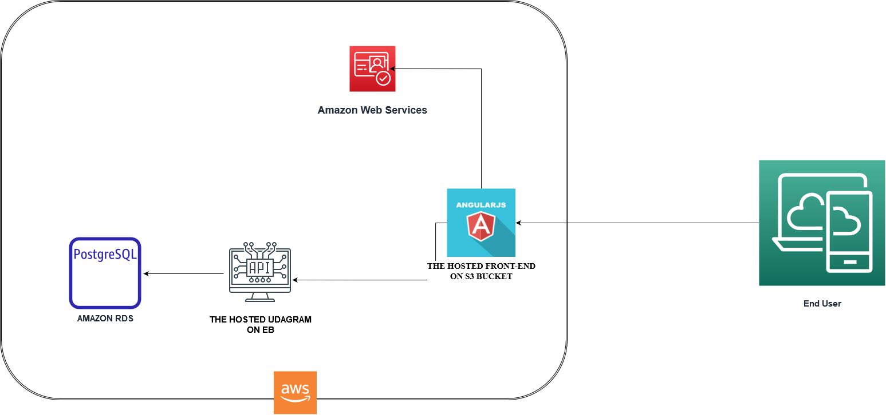

## Infrastructure

1. RDS which hosts our postgres database by using postgresql
- DB Endpoint: [postgres.c4favmmtrav1.us-east-1.rds.amazonaws.com]
2. S3 Bucket for hosting our front-end which is using 
- S3 url [http://udagram-deploy.s3-website-us-east-1.amazonaws.com]
3. EB for hosting our back-end-app by using NodeJS and typescript
- EB Endpoint url [http://udagrambackenddev-env-1.eba-4ts28dpt.us-east-1.elasticbeanstalk.com/]
