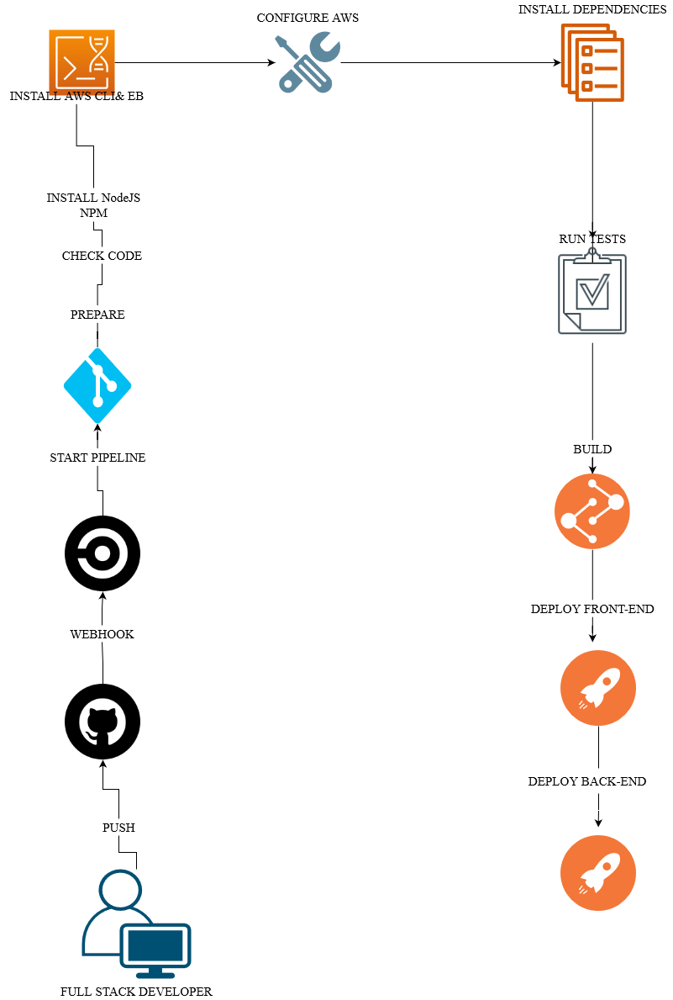

### CIRCLE CI OF UDAGRAM
## Pipeline
1. Commit and push our code to github respiratory
2. Trigger and setup project on Circle Ci 
3. Circle Ci start operatiom
```
Install AWS CLI
EB CLI.
Configure AWS 
Install Front-End Dependencies
Install Back-End Dependencies
Build Back-End
Build Back-End
Run tests (not used)
Deploy Front-End 
Deploy Back-End 
``` 
### Pipeline Overview
